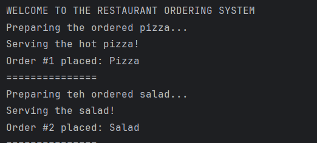
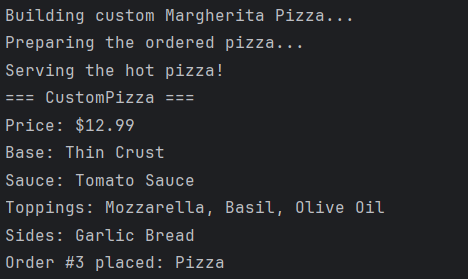
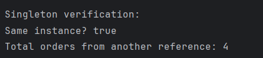

# Creational Design Patterns


## Author: Daria Ratteeva

----

## Objectives:

* Get familiar with the Creational Design Patterns;
* Choose a specific domain;
* Implement at least 3 Creational Design Patterns for the specific domain;


## Used Design Patterns:

* Singleton Pattern
* Factory Method Pattern
* Builder Pattern


## Implementation

### Singleton Pattern

The Singleton pattern is implemented in the RestaurantOrderSystem class to ensure that only one instance of the order management system exists throughout the application. The implementation uses a private static variable to hold the single instance, a private constructor to prevent external instantiation, and a public static getInstance() method that provides global access to the instance using lazy initialization. This approach guarantees that all parts of the restaurant application access the same order system, maintaining consistent order history, revenue tracking, and statistics, which is essential for preventing data fragmentation and ensuring accurate business operations.

**RestaurantOrderSystem:**
```
public class RestaurantOrderSystem {

    // Static instance variable
    private static RestaurantOrderSystem instance;

    // Order management
    private List<Meal> orderHistory;
    private int totalOrders;
    private double totalRevenue;

    // Private constructor
    private RestaurantOrderSystem() {
        this.orderHistory = new ArrayList<>();
        this.totalOrders = 0;
        this.totalRevenue = 0.0;
    }

    // Static method to get the single instance
    public static RestaurantOrderSystem getInstance() {
        if (instance == null) {
            instance = new RestaurantOrderSystem();
        }
        return instance;
    }
}

```

---

### Factory Method Pattern

The Factory Method pattern is implemented through an abstract MealFactory class and its concrete subclasses (ItalianMealFactory, AmericanMealFactory, HealthyMealFactory) to create different types of meals without specifying their exact classes. Each concrete factory overrides the abstract createMeal() method to instantiate specific meal types (Pizza, Pasta, Burger, Salad) based on the cuisine type. This implementation follows the Open-Closed Principle, allowing new cuisine types and meal varieties to be added without modifying existing code, while the orderMeal() template method ensures consistent meal preparation and serving across all factories.

**MealFactory (Abstract Creator):**
```
public abstract class MealFactory {
    // Factory Method
    public abstract Meal createMeal();
    // Template method that uses the factory method
    public Meal orderMeal() {
        Meal meal = createMeal();
        meal.prepare();
        meal.serve();
        return meal;
    }
}
```

**ItalianMealFactory (Concrete Creator):**
```
public class ItalianMealFactory extends MealFactory {
    private String mealType;
    public ItalianMealFactory(String mealType) {
        this.mealType = mealType;
    }
    @Override
    public Meal createMeal() {
        if (mealType.equalsIgnoreCase("pizza")) {
            return new Pizza();
        } else if (mealType.equalsIgnoreCase("pasta")) {
            return new Pasta();
        }
        return null;
    }
}
```
**AmericanMealFactory (Concrete Creator):**
```
public class AmericanMealFactory extends MealFactory {
    @Override
    public Meal createMeal() {
        return new Burger();
    }
}
```

**HealthyMealFactory (Concrete Creator):**
```
public class HealthyMealFactory extends MealFactory {
    @Override
    public Meal createMeal() {
        return new Salad();
    }
}

```
**Usage in Main.java:**
```
MealFactory italianFactory = new ItalianMealFactory("pizza");
        Meal pizza = italianFactory.orderMeal();
        orderSystem.placeOrder(pizza);
```
---

### Builder Pattern

The Builder pattern is implemented through the MealBuilder interface and its concrete implementations (PizzaBuilder, BurgerBuilder, SaladBuilder) to construct complex meal objects step-by-step with multiple optional parameters. Each builder provides methods for setting different meal components (base, protein, vegetables, sauce, toppings, sides) that return the builder itself, enabling method chaining for a fluent and readable API. This approach solves the problem of creating objects with numerous optional parameters by allowing clients to specify only the desired components in any order, resulting in more maintainable code compared to constructors with multiple parameters.
    
**MealBuilder.java (Builder Interface):**
```
public interface MealBuilder {
    MealBuilder setBase(String base);
    MealBuilder addProtein(String protein);
    MealBuilder addVegetables(String vegetables);
    MealBuilder addSauce(String sauce);
    MealBuilder addToppings(String toppings);
    MealBuilder addSides(String sides);
    Meal build();
}
```

**Usage Example:**
```
System.out.println("Building custom Margherita Pizza...");
        Meal customPizza = new PizzaBuilder()
                .setBase("Thin Crust")
                .addSauce("Tomato Sauce")
                .addToppings("Mozzarella, Basil, Olive Oil")
                .addSides("Garlic Bread")
                .build();
        customPizza.prepare();
        customPizza.serve();
        customPizza.displayInfo();
        orderSystem.placeOrder(customPizza);
```


## Conclusions

This laboratory work successfully demonstrated the implementation of three fundamental creational design patterns—Singleton, Factory Method, and Builder—in a Restaurant Food Ordering System developed in Java using IntelliJ IDEA. The Singleton pattern ensured centralized order management with a single system instance, the Factory Method pattern provided flexible meal creation across different cuisine types without tight coupling, and the Builder pattern enabled step-by-step construction of complex customized meals with multiple optional parameters. Through this practical implementation, we observed how design patterns promote code reusability, maintainability, and extensibility while following SOLID principles. The project demonstrated that creational patterns effectively solve common object instantiation problems by encapsulating creation logic, reducing code redundancy, and providing clear separation of concerns. These patterns work harmoniously together, with factories creating standard meals quickly, builders customizing complex configurations, and the singleton coordinating all operations, resulting in a robust, scalable, and easily maintainable software architecture that can accommodate future enhancements without requiring significant code modifications.
## Screenshots






