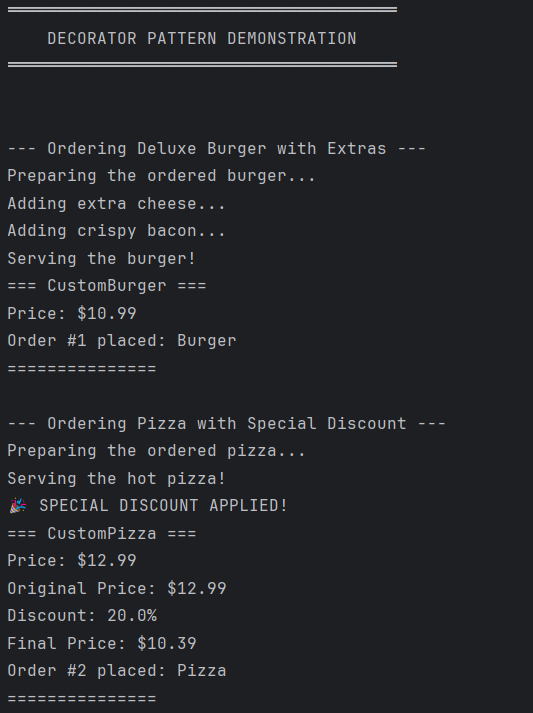

# Structural Design Patterns

## Author: Daniel Cojocaru

----

## Objectives:

* Study and understand the Structural Design Patterns
* As a continuation of the previous laboratory work, think about the functionalities that the system will need to provide to the user
* Implement at least 3 Structural Design Patterns for the specific domain

## Used Design Patterns:

* Composite Pattern
* Decorator Pattern
* Facade Pattern

## Implementation

### Composite Pattern

The Composite pattern composes objects into tree structures to represent part-whole hierarchies, allowing clients to treat individual objects and compositions uniformly. In this project, the Composite pattern enables meal combos that can contain individual meals or other combos, with recursive operations for pricing, preparation, and display.

**Location:** `composite/` package

**Structure:**
- **Component Interface:** `MealComponent`
- **Leaf Classes:** `Meal` (abstract), `Pizza`, `Burger`, `Salad`, `Pasta`
- **Composite Class:** `MealCombo`

**Key Implementation - MealComponent.java:**

The component interface defines operations that work uniformly for both individual meals and combos:

```
public interface MealComponent {
    String getName();
    double getPrice();
    void displayInfo();
    void prepare();
    void serve();
}
```

**Key Implementation - MealCombo.java:**

The composite manages child components and implements recursive operations. When calculating price, it iterates through all items and applies a combo discount:
```
public class MealCombo implements MealComponent {
    private String name;
    private List<MealComponent> items;
    private double discount;
    
    public void add(MealComponent item) {
        items.add(item);
    }
    
    @Override
    public double getPrice() {
        double total = 0.0;
        for (MealComponent item : items) {
            total += item.getPrice();  // Recursive call
        }
        return total * (1 - discount / 100);
    }
    
    @Override
    public void prepare() {
        for (MealComponent item : items) {
            item.prepare();  // Delegates to each child
        }
    }
}
```

**Usage Example**
```
// Create family combo with 15% discount
MealCombo familyCombo = new MealCombo("Family Combo", 15.0);
familyCombo.add(new Pizza());   // $12.99
familyCombo.add(new Pizza());   // $12.99
familyCombo.add(new Burger());  // $10.99
familyCombo.add(new Salad());   // $8.99
// Total: $38.96 (after 15% discount)
```
---
### Decorator Pattern

The Decorator pattern attaches additional responsibilities to objects dynamically by wrapping them in decorator objects that add new behaviors. In this project, decorators enable adding extras (cheese, bacon) and applying discounts to meals at runtime without modifying the original meal classes or creating numerous subclass combinations.

**Location:** `decorator/` package

**Structure:**
- **Component Interface:** `MealComponent` (shared with Composite pattern)
- **Concrete Components:** `Pizza`, `Burger`, `Salad`, `Pasta`
- **Base Decorator:** `MealDecorator` (abstract)
- **Concrete Decorators:** `ExtraCheeseDecorator`, `BaconDecorator`, `DiscountDecorator`

**Key Implementation - MealDecorator.java:**

The base decorator implements MealComponent and holds a reference to the wrapped meal, delegating all operations to it:

```
public abstract class MealDecorator implements MealComponent {
    protected MealComponent wrappedMeal;
    
    public MealDecorator(MealComponent meal) {
        this.wrappedMeal = meal;
    }
    
    @Override
    public String getName() {
        return wrappedMeal.getName();
    }
    
    @Override
    public double getPrice() {
        return wrappedMeal.getPrice();
    }
    
    @Override
    public void prepare() {
        wrappedMeal.prepare();
    }
}
```

**Key Implementation - ExtraCheeseDecorator.java:**

Concrete decorators extend the base decorator and add specific behavior before or after delegating to the wrapped object:

```
public class ExtraCheeseDecorator extends MealDecorator {
    private static final double EXTRA_COST = 1.50;
    
    public ExtraCheeseDecorator(MealComponent meal) {
        super(meal);
    }
    
    @Override
    public String getName() {
        return wrappedMeal.getName() + " + Extra Cheese";
    }
    
    @Override
    public double getPrice() {
        return wrappedMeal.getPrice() + EXTRA_COST;
    }
    
    @Override
    public void prepare() {
        wrappedMeal.prepare();
        System.out.println("Adding extra cheese...");
    }
}
```

**Key Implementation - DiscountDecorator.java:**

The discount decorator reduces the price by a percentage while preserving the original meal's behavior:

```
public class DiscountDecorator extends MealDecorator {
    private double discountPercent;
    
    public DiscountDecorator(MealComponent meal, double discountPercent) {
        super(meal);
        this.discountPercent = discountPercent;
    }
    
    @Override
    public String getName() {
        return wrappedMeal.getName() + " (" + discountPercent + "% OFF)";
    }
    
    @Override
    public double getPrice() {
        return wrappedMeal.getPrice() * (1 - discountPercent / 100);
    }
}
```

**Usage Example:**
Decorators can be stacked in multiple layers to combine behaviors:
```
// Start with base burger ($10.99)
Burger burger = new Burger();

// Add extra cheese ($12.49)
MealComponent withCheese = new ExtraCheeseDecorator(burger);

// Add bacon ($14.99)
MealComponent withCheeseAndBacon = new BaconDecorator(withCheese);

// Apply 20% discount ($11.99)
MealComponent finalMeal = new DiscountDecorator(withCheeseAndBacon, 20.0);

```

---

### Facade Pattern

The Facade pattern provides a simplified, unified interface to a complex subsystem consisting of multiple interacting classes and design patterns. In this project, the facade coordinates all restaurant operations (ordering, customization, combos, statistics) by hiding the complexity of factories, builders, decorators, composites, and the order system.

**Location:** `facade/` package

**Structure:**
- **Facade:** `RestaurantFacade`
- **Complex Subsystems** `Factory subsystem` (meal creation), `Builder subsystem` (customization), `Decorator subsystem` (extras/discounts), `Composite subsystem` (combos), `Singleton subsystem` (order tracking)

**Key Implementation - RestaurantFacade.java:**

The facade provides high-level methods that hide complex multi-step processes from the client:

```
public class RestaurantFacade {
    private RestaurantOrderSystem orderSystem;
    
    public RestaurantFacade() {
        this.orderSystem = RestaurantOrderSystem.getInstance();
    }
    
    // Simple factory-based order
    public void orderPizza() {
        System.out.println("\n--- Ordering Standard Pizza ---");
        MealFactory factory = new ItalianMealFactory("pizza");
        Meal pizza = factory.orderMeal();
        orderSystem.placeOrder(pizza);
    }
    
    // Custom builder-based order
    public void orderCustomBurger(String base, String protein, String vegetables) {
        System.out.println("\n--- Ordering Custom Burger ---");
        MealBuilder builder = new BurgerBuilder();
        Meal customBurger = builder
            .setBase(base)
            .addProtein(protein)
            .addVegetables(vegetables)
            .build();
        orderSystem.placeOrder(customBurger);
    }
    
    // Decorated order with multiple wrappers
    public void orderBurgerWithExtras() {
        System.out.println("\n--- Ordering Burger with Extras ---");
        Burger burger = new Burger();
        MealComponent decorated = new ExtraCheeseDecorator(burger);
        decorated = new BaconDecorator(decorated);
        orderSystem.placeOrder((Meal) decorated);
    }
    
    // Composite combo creation
    public void orderFamilyCombo() {
        System.out.println("\n--- Ordering Family Combo ---");
        MealCombo familyCombo = new MealCombo("Family Combo", 15.0);
        familyCombo.add(new Pizza());
        familyCombo.add(new Pizza());
        familyCombo.add(new Burger());
        familyCombo.add(new Salad());
        orderSystem.placeOrder(new ComboMeal(familyCombo));
    }
    
    // Statistics delegation
    public void displayStatistics() {
        orderSystem.displayStatistics();
    }
}

```

**Usage Example in Main.java**
```
RestaurantFacade restaurant = new RestaurantFacade();

// Simple one-line operations
restaurant.orderPizza();
restaurant.orderBurger();
restaurant.orderCustomBurger("Sesame Bun", "Beef Patty", "Lettuce, Tomato");
restaurant.orderBurgerWithExtras();
restaurant.orderFamilyCombo();
restaurant.displayStatistics();

```

## Conclusions

This laboratory work successfully demonstrates the implementation of three structural design patterns in a restaurant ordering system, showcasing how these patterns create a flexible and maintainable architecture. The Composite pattern, implemented through the MealComponent interface and MealCombo class, enables the system to treat individual meals and meal combinations uniformly with recursive operations for pricing and preparation. The Decorator pattern, achieved through MealDecorator and its concrete implementations (ExtraCheeseDecorator, BaconDecorator, DiscountDecorator), allows dynamic addition of responsibilities at runtime by wrapping meals in layers without creating subclass explosion. The Facade pattern, implemented through RestaurantFacade, provides a simplified unified interface that coordinates all complex subsystems and hides implementation details from client code. These patterns work together seamlessly through the shared MealComponent interface, which serves dual roles for both Composite and Decorator patterns, demonstrating effective pattern cooperation. The implementation adheres to SOLID principles, particularly the Open/Closed Principle and Single Responsibility Principle, while promoting code reusability through composition over inheritance. This laboratory work effectively proves that structural design patterns are essential for organizing complex systems into flexible, maintainable architectures that can evolve without extensive refactoring.

## Screenshots
  
This screenshot demonstrates the Decorator pattern by wrapping meals with additional behaviors at runtime. The burger is wrapped in ExtraCheeseDecorator and BaconDecorator, with each adding its own preparation step, while the pizza is wrapped in DiscountDecorator, which applies a 20% discount and shows the calculation from $12.99 to $10.39. This illustrates how decorators can be stacked in layers to add functionality without modifying the original meal classes.
  
This screenshot shows the Composite pattern treating individual meals and combos uniformly through recursive operations. The Family Combo contains four meals (two pizzas, a burger, and a salad) that are automatically prepared and served when the combo's methods are called. The price calculation recursively sums all items ($45.96) and applies the 15% discount to reach the final total of $39.07, demonstrating how composites manage hierarchical structures transparently.
  
This screenshot demonstrates how the Facade pattern provides a simplified interface to the restaurant system. The order history shows four orders tracked centrally by the RestaurantOrderSystem singleton, with total statistics of 4 orders and $72.94 revenue. Behind simple method calls like orderBurgerWithExtras() and orderFamilyCombo(), the facade coordinated multiple complex subsystems including decorators, composites, and order tracking, hiding all this complexity from the client code.